# [Naisei](https://naisei.info/signup)

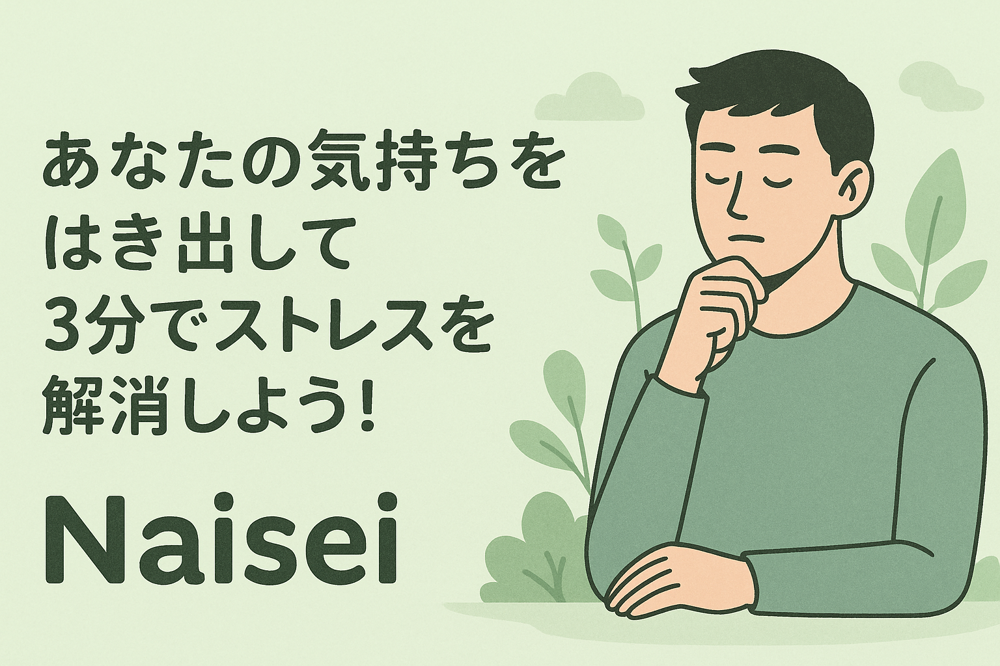

## 1. サービス概要

**あなたの気持ちをはき出して3分でストレスを解消しよう！**

働く青年・中年層が抱える様々なストレスやもやもやした感情を、表現型ライティング（Expressive Writing）によって解消する日記アプリです。感情や思考を文章として自由に書き出すことで、心の中に蓄積されたストレスや不安を軽減し、精神的な健康向上をサポートします。

## 2. 課題と背景

**中高年層のメンタルヘルス支援の不足**

日本社会では、働く中高年層が社会的孤立や心理的ストレスを原因とするメンタルヘルス問題に直面しており、これが抑うつ症状やストレス関連疾患の増加につながっています。

**他年代との支援格差**

- **子ども向け**: 学校教育におけるメンタルヘルス教育や予防プログラムが整備済み
- **女性向け**: 月経前メンタルヘルスアプリなどの具体的な商品・施策が展開
- **中高年層向け**: 厚生労働省調査で課題が明らかになっているものの、具体的な政策介入や支援アプリが不十分

中高年層のメンタルヘルス悪化は主観的健康感の低下や社会参加活動からの撤退が要因とされているにもかかわらず、この層に特化した支援策が圧倒的に不足している状況です。

## 3. 解決方法

**表現型ライティング（Expressive Writing）の活用**

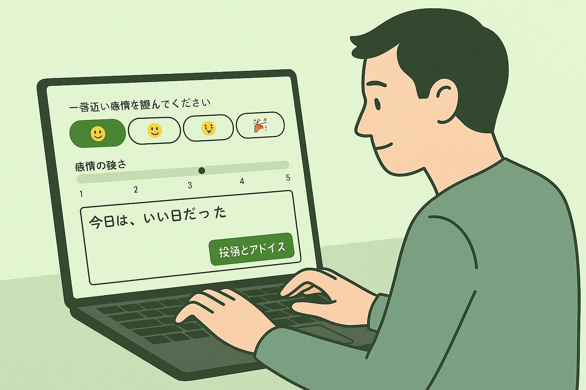

心理学者James Pennebakerによって提唱された手法を採用し、以下の効果により心理的課題を解決します：

**科学的根拠に基づく効果**

- 抑うつ・不安症状の緩和
- ポジティブな感情の増加
- 心理的ストレスの軽減

**オンライン環境での実証済み効果**

- COVID-19パンデミック中の研究で有効性を確認
- 自宅で簡単に取り組める利便性
- タイピング形式でも心理的改善効果が得られることを実証
- 孤立感や不安感の緩和に寄与

**アプリでの具体的実装**

- 感情の選択と評価を簡単に行えるUI
- 過去の感情をカレンダー表示で可視化
- 習慣化をサポートする設定機能（LINE通知、行動トリガー設定）

## 4. 非機能要件

### パフォーマンス要件

- **画面ロード時間**: 通常利用条件下で2秒以内
- **ChatGPT APIフィードバック**: 10秒以内での生成完了
- **グラフ表示**: 感情データ・履歴の1秒以内レンダリング

### ユーザビリティ要件

- **直感的インターフェース**: 主要操作（ライティング開始等）を3クリック以内で完了
- **使いやすさ重視**: シンプルで迷いのない画面設計

### 保守性・管理性要件

- **モジュール化設計**: 新機能追加・修正の容易性確保
- **ログ収集・エラーレポート**: 迅速なトラブルシューティング機能実装

### プライバシー・セキュリティ要件

- **データ暗号化**: BCryptライブラリによる重要ユーザーデータの暗号化保存
- **HTTPS通信**: HTTPアクセスの自動リダイレクトによる全通信の暗号化
- **セッション管理**: セッションIDによるユーザー認証状態の安全な管理
- **CSRF対策**: Rails標準機能による偽造リクエスト攻撃の防止

## 5. 使用技術

- **フロントエンド**: HTML5（ERB）, hotwired/turbo-rails ^8.0.13, Tailwind CSS ^4.1.11, daisyUI ^5.0.35
- **バックエンド**: Ruby 3.4.2, Ruby on Rails 7.1.5.1
- **インフラ**: AWS(ECR, ECS, RDS, ACM, Route53, Secrets Manager等)、ネットワーク基礎
- **API**: Messaging API(LINE), OpenAI API
- **その他**: MySQL 8.4, Git 2.39.5, Linux, Docker 28.2.2, Docker Compose v2.37.1-desktop.1

## 6. ER図

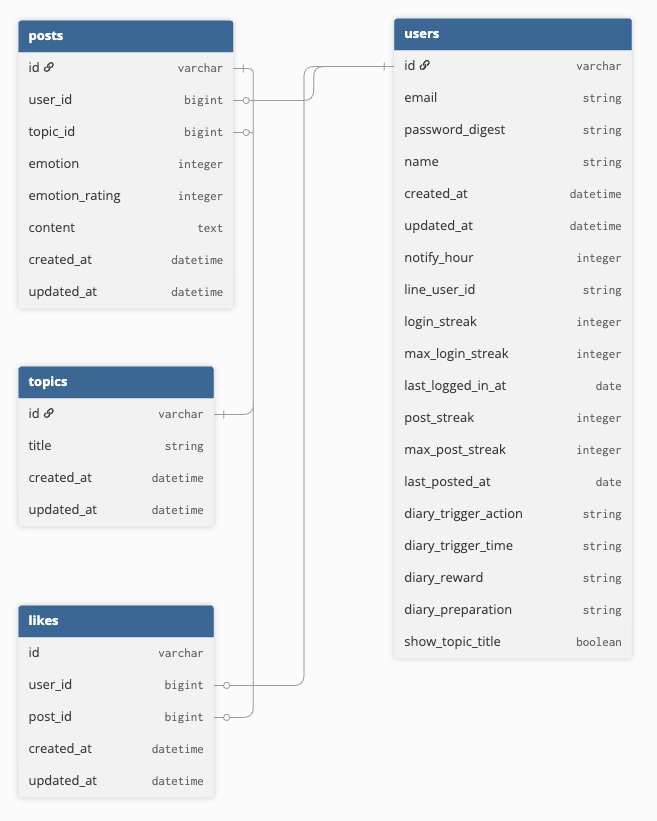

## 7. インフラ構成図

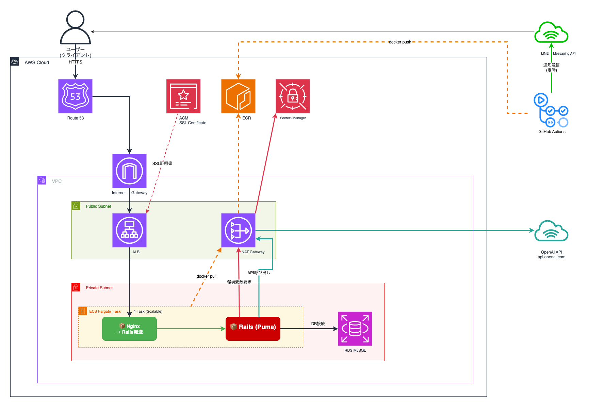

## 8. 画面遷移図

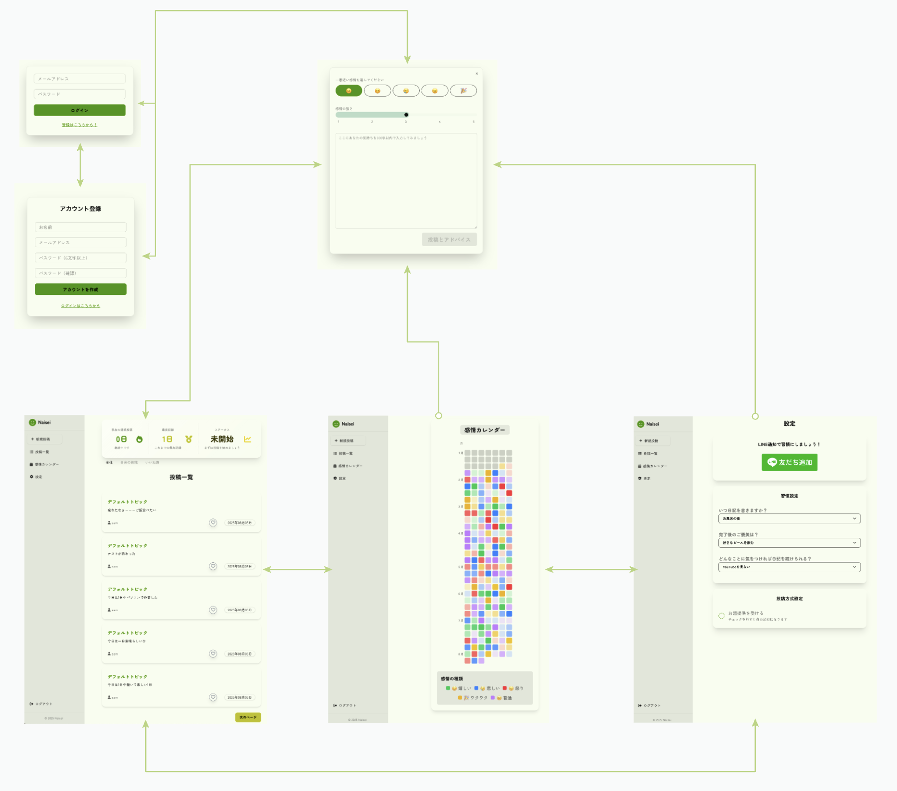

## 9. ペルソナ

ペルソナ1: 営業部長の田中 健一

**名前**: 田中 健一（たなか けんいち）  
**年齢**: 52歳  
**職業**: 中小企業の営業部長  
**家族構成**: 妻（50歳）、息子（24歳・社会人）、娘（21歳・大学生）  
**住所**: 東京都練馬区

### 背景

- 長年営業職を務め、部長職として部下管理と売上達成を担う
- 子育てが一段落し、会話減少と夫婦関係の距離感
- 役職定年が近づき、将来のキャリア・収入への不安

### 主な悩み

1. **仕事での小さなストレス蓄積**
   - ノルマ管理・顧客対応・部下との摩擦・曖昧な上司指示
2. **家庭でのストレス蓄積**
   - 会話不足、役割の希薄化による孤独感
3. **健康面の漠然とした不安**
   - 高血圧傾向・運動不足
4. **自己認識とキャリア再設計**
   - 「このままで良いのか」という漠然とした疑問

### 年収

約600万円

### ライフスタイル

- 起床6:30（平日）、8:00（休日）
- 通勤40分（電車）
- 趣味: 読書（歴史小説・ビジネス書）、家庭菜園、散歩

ペルソナ2: 地方在住の工場勤務 杉江 潤

**名前**: 杉江 潤（すぎえ じゅん）  
**年齢**: 36歳  
**職業**: 製造業（品質管理担当）  
**家族構成**: 独身、一人暮らし（地方都市）

### 背景

- 地方大学卒業後、地元製造業勤務
- 昇進機会が少なくキャリア停滞感
- 地元での家族関係は良好だが、友人・恋愛関係は希薄

### 主な悩み

1. **仕事での小さなストレス蓄積**
   - ミスが許されない品質管理業務
   - 昇進機会の少なさ
   - 同僚との疎外感
2. **孤独感と人間関係**
   - 独身生活による孤立感
   - 趣味仲間の不足
3. **自己理解と趣味の停滞**
   - 新しい趣味を見つけたいが一歩踏み出せない

### 年収

約450万円

### ライフスタイル

- 起床6:30（平日）、9:00（休日）
- 通勤30分（車）
- 趣味: アニメ・漫画鑑賞、オンラインゲーム、風景写真撮影

## 10. アプリのスクリーンショット

| 画面                                                           | タイトル               | 説明                                                                                                                                                                                                                                                                                                                                                                                         |
| -------------------------------------------------------------- | ---------------------- | -------------------------------------------------------------------------------------------------------------------------------------------------------------------------------------------------------------------------------------------------------------------------------------------------------------------------------------------------------------------------------------------- |
| 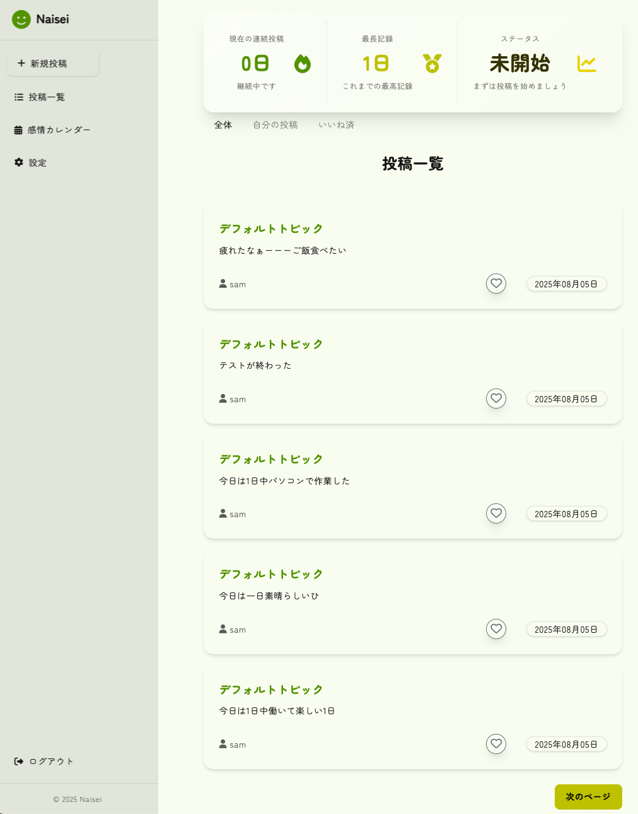                   | メイン画面（投稿一覧） | 全ユーザーの投稿、自分の投稿、いいね済み投稿の3パターンをボタンで切り替えて表示できる画面です。投稿は最新順に並び、必要な情報に素早くアクセスできます。ユーザーが投稿した後はChatGPTからの共感的なフィードバックが表示されます。継続利用日数や最長達成記録を表示する「一貫性と計画性」機能により、利用のモチベーション維持をサポートします。                                                 |
| 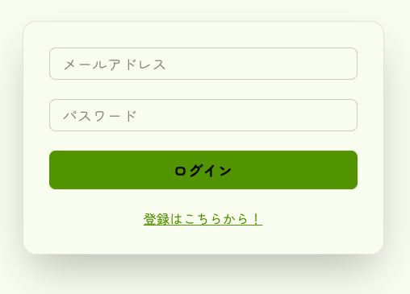                  | ログイン画面           | 登録済みユーザーがメールアドレスとパスワードでログインできる画面です。シンプルな入力フォームで、迷わず素早く利用を開始できます。                                                                                                                                                                                                                                                             |
| 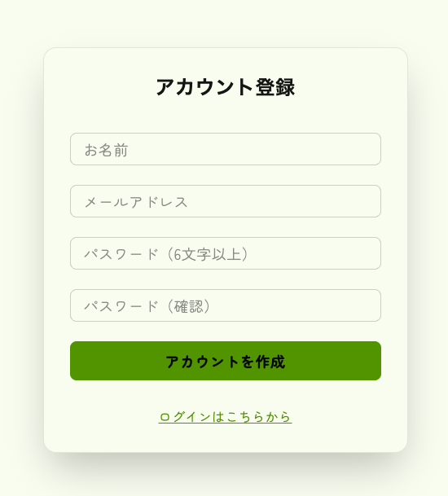             | サインアップ画面       | 新規ユーザーがアカウントを作成するための画面です。メールアドレスと英数字6文字以上のパスワードを入力し、バリデーションによって安全性を確保します。登録完了後はそのまま利用を開始できます。                                                                                                                                                                                                    |
| 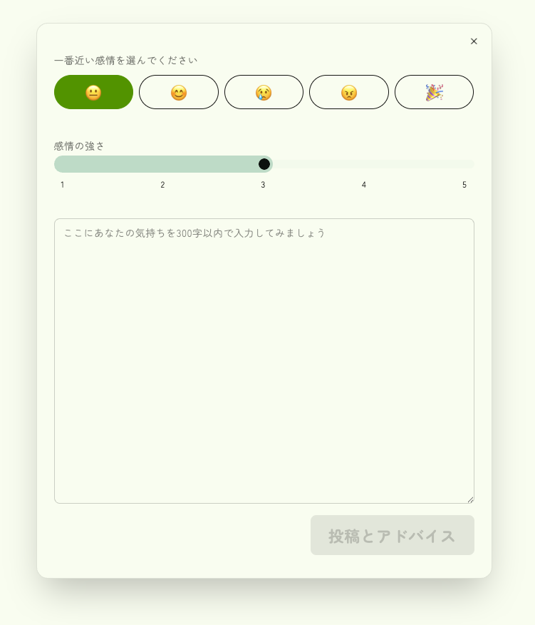             | 新規投稿画面           | 表現型ライティングを行うためのテキスト入力エリアを備えています。自由記入モードに加え、初心者向けのお題を選んで書くモードもあり、テーマ選びの負担を減らすことで習慣化をサポートします。感情を選択し、感情スライダーで強さを評価してから投稿することで、もやもやした感情を言葉にする前に認識でき、内省がより深まります。投稿データは日付や感情情報と共に保存され、後で傾向分析に活用できます。 |
| 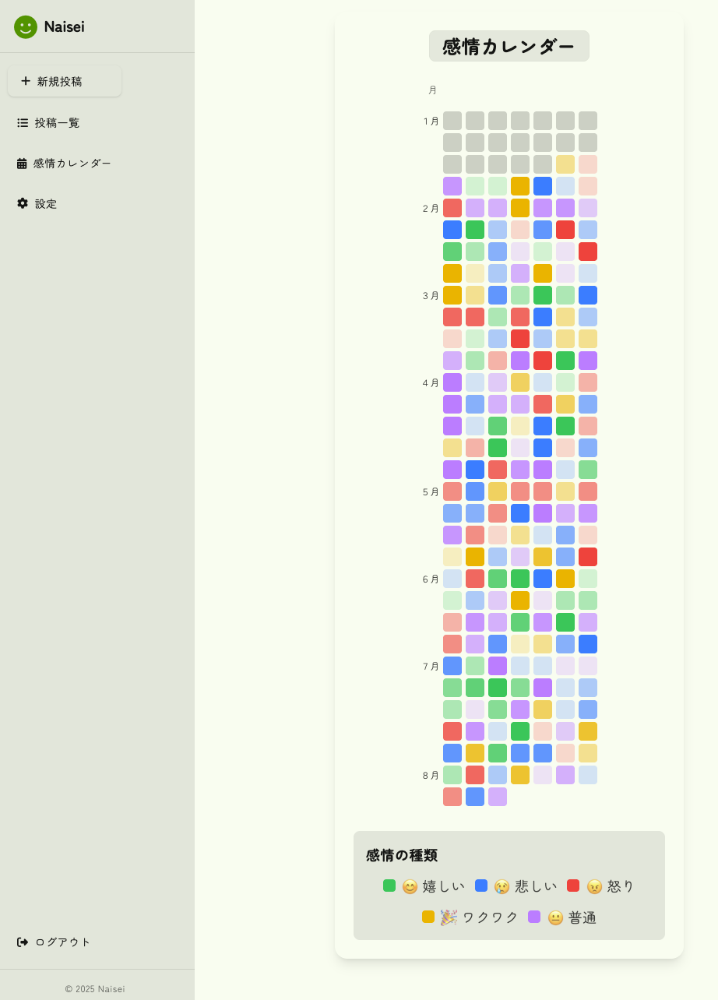 | 感情カレンダー画面     | 過去の投稿を日付ごとに色分けして表示し、感情の傾向や変化をひと目で把握できます。月単位での変化が視覚的に分かるため、自己分析や習慣形成に役立ちます。                                                                                                                                                                                                                                         |
| 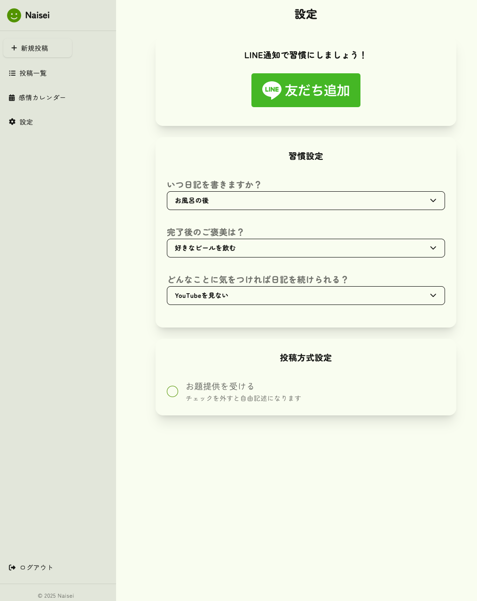                   | 設定画面               | ユーザー情報の編集、通知設定、テーマカラー変更に加え、習慣化支援の4つの方法（既存習慣との紐付け、報酬設定、一貫性と計画性、障害物の除去）を記入・管理できます。公式LINEアカウントを友達に追加することで、定時にリマインダーを受信できる機能も備えています。                                                                                                                                  |

## 11. 参考文献

### メンタルヘルス・アプリケーション関連

**[1]** [先端教育オンライン - 学校教育におけるメンタルヘルス教育](https://www.sentankyo.jp/articles/b4b506fc-7954-4439-81ad-a2b6eb2e5a08)  
学校教育におけるメンタルヘルス教育の事例紹介ページ。

**[2]** [ライオン株式会社 - 月経前・月経中の心の不調向けスマホアプリ提供開始](https://www.lion.co.jp/ja/news/2023/4320#:~:text=*)  
月経前・月経中の心の不調向けスマホアプリの提供開始に関する情報。

**[3]** [厚生労働省 - メンタルヘルスに関する調査結果](https://www.mhlw.go.jp/content/001232761.pdf)  
メンタルヘルスに関する調査結果を掲載した厚生労働省公開資料。

**[4]** [J-STAGE - 中高年層の主観的健康感と社会参加に関する研究](https://www.jstage.jst.go.jp/article/keizaikenkyu/75/2/75_er.ar.033324/_article/-char/ja)  
中高年層の主観的健康感と社会参加に関する経済研究論文。

### 表現型ライティング関連

**[5]** [SAGE Journals - Pennebaker実証研究](https://journals.sagepub.com/doi/10.1177/0146167295213005)  
Pennebakerの実証研究を掲載したSAGEの論文ページ。

**[6]** [NCBI PubMed Central - COVID-19期間中の表現型ライティング効果](https://pmc.ncbi.nlm.nih.gov/articles/PMC8314796/)  
COVID-19期間中の表現型ライティング効果に関する研究論文。

**[7]** [エクセター大学リポジトリ - タイピング形式での表現型ライティング効果](https://ore.exeter.ac.uk/repository/bitstream/handle/10871/34176/DrewN.pdf?sequence=1)  
タイピングでの表現型ライティングに関する研究論文。
